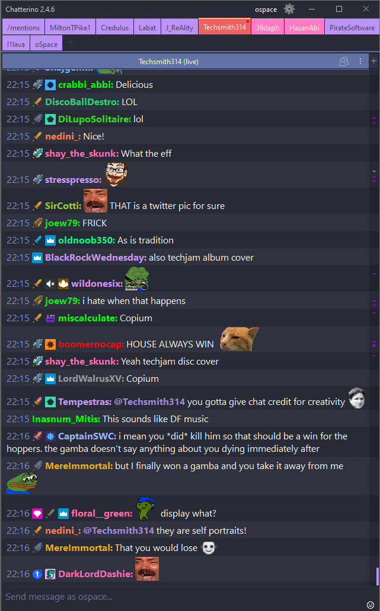

# Dracula for [Chatterino](https://chatterino.com/)

> A dark theme for [Chatterino](https://chatterino.com/).

## Install

1. Download Dracula.json.
2. Place it in the `Themes` folder: *([Check Chatterino's wiki for more info](https://wiki.chatterino.com/Settings/#where-is-my-chatterino-folder-located))*
    - On Windows: `%APPDATA%/Chatterino2`
    - On Linux: `$HOME/.local/share/chatterino`
    - On Mac: `$HOME/Library/Application Support/chatterino`

3. Relaunch Chatterino if open, go to **Settings > General > Theme** and select `Custom: Dracula`.
4. It's working! ✨

## Team

This theme is maintained by the following person(s) and a bunch of [awesome contributors](https://github.com/dracula/chatterino/graphs/contributors).

|      |
| ---------------------------------------------------------------------------------- |
| [iSpace202](https://github.com/iSpace202)                                                |

## Community

- [Twitter](https://twitter.com/draculatheme) - Best for getting updates about themes and new stuff.
- [GitHub](https://github.com/dracula/dracula-theme/discussions) - Best for asking questions and discussing issues.
- [Discord](https://draculatheme.com/discord-invite) - Best for hanging out with the community.

## License

[MIT License](./LICENSE)
